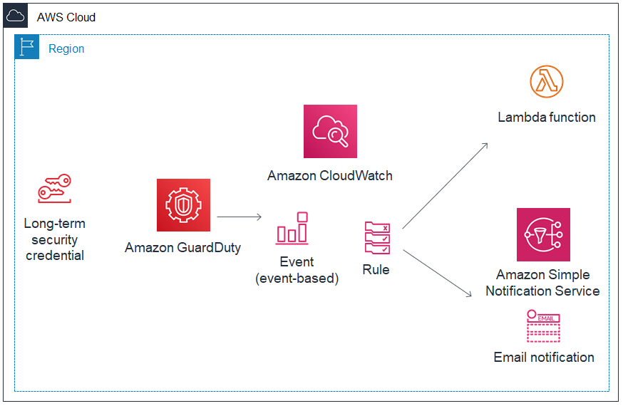

# GuardDuty Automatic Event Response

## 1. Deploy the Amazon Guardduty Tester environement

Perform the **Prerequisites** and **Step1** from https://github.com/awslabs/amazon-guardduty-tester 

## 2. Deploy Automatic Event Response Solution
**a.** Create a new CloudFormation stack using **guardduty-auto-event-response-cf.yaml** to 
deploy the various AWS components required to build Automatic Event Response. Refer
the below diagram for the solution.



Deploy via AWS Cli
```
aws cloudformation deploy \
--template-file guardduty-auto-event-response-cf.yaml \
--stack-name guardduty-auto-test \
--capabilities CAPABILITY_NAMED_IAM \
--parameter-overrides \
QuarantineSecurityGroupName=guardduty-quarantine
```

**b.** Subcribe an email address to the SNS topic created.

## 3. Run the Test

Perform **Step2** and **Step3** from https://github.com/awslabs/amazon-guardduty-tester 

## 4. Expected result
#### GuardDuty
Expect to see several findings( could take upto 15 mins )

#### Cloudwatch Event
The Cloudwatch event rule will trigger the SNS Notifcation and Lambda function

#### SNS Notifcation
Expect to receive an Email notification, to the email subcribed to the SNS topic.
The Body of the Email should use the input transform.

#### Lambda
The lambda function should be executed which should,
1.  Create a Quarantine Security Group in the VPC (with the compromised EC2 instance) if it does not exist.
2.  Add a tag **GuardDuty Status: Quarantined** to the compromised EC2 instance.
3.  Remove the existing security groups on the compromised EC2 instance and replace it with the Quarantine Security Group.