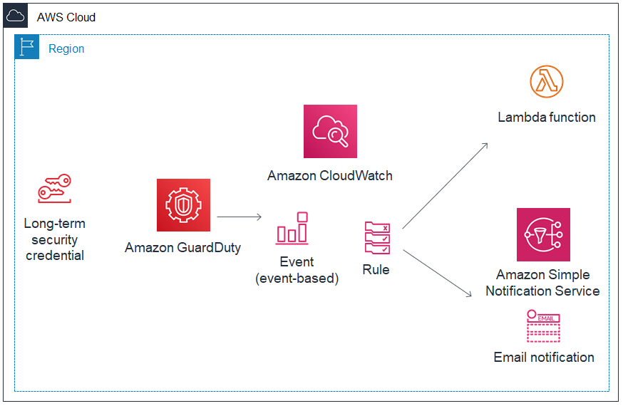

# GuardDuty Automatic Event Response

## Introduction
This solution demonstrates how Incident Response can be automated in AWS, using GuardDuty, CloudWatch Event Rules, Lambda and SNS. CloudFormation is used template and deploy the solution.

This solution can be tested either by [generating sample findings in the GuardDuty console](https://docs.aws.amazon.com/guardduty/latest/ug/guardduty_findings.html#guardduty_sample-findings) or by using the [GuardDuty Proof of Concept](https://docs.aws.amazon.com/guardduty/latest/ug/guardduty_findings.html#guardduty_findings-scripts) to generate real findings based on exploiting real attack vectors.

## 1. Deploy the Amazon GuardDuty Proof of Concept environment

Perform the **Prerequisites** and **Step1** from [Amazon Guardduty Tester](https://github.com/awslabs/amazon-guardduty-tester)

## 2. Deploy Automatic Event Response Solution

**a.** Create a new CloudFormation stack using **guardduty-auto-event-response-cf.yaml** to 
deploy the various AWS components required to build Automatic Event Response. Refer
the below diagram for the solution.



Deploy the template using CloudFormation in the AWS Console

or

Deploy the template using CloudFormation via AWS Cli
```
aws cloudformation deploy \
--template-file guardduty-auto-event-response-cf.yaml \
--stack-name guardduty-auto-response \
--capabilities CAPABILITY_NAMED_IAM \
--parameter-overrides \
QuarantineSecurityGroupName=guardduty-quarantine
```

**b.** Subcribe an email address to the SNS topic created.

## 3. Run the Test

Perform **Step2** and **Step3** from [Amazon Guardduty Tester](https://github.com/awslabs/amazon-guardduty-tester) 

## 4. Expected result

#### GuardDuty
Expect to see several findings (could take up to 15 mins )

#### Cloudwatch Event
The Cloudwatch event rule will trigger the SNS Notifcation and Lambda function

*Click for [sample GuardDuty cloudwatch event](docs/guardduty-cloudwatch-event-sample.json)*

#### SNS Notifcation
Expect to receive an Email notification to the email address subcribed to the SNS topic.
The body of the Email should use the input template specified in the CloudWatch rule.

#### Lambda
The lambda function should be executed which should,
1.  Create a Quarantine Security Group in the VPC (with the compromised EC2 instance) if it does not exist.
2.  Add a tag **GuardDuty Status: Quarantined** to the compromised EC2 instance.
3.  Remove the existing security groups on the compromised EC2 instance and replace it with the Quarantine Security Group.

## Clean Up

**Don't forget to clean up the resource you created to avoid**
1. Manually delete the SNS email subcription and the Quarantine Security Group.
2. Delete the **Automatic Event Response Solution cloudformation** stack.
3. Delete the **Amazon Guardduty Tester environement** stack.
4. [Suspend or Disable GuardDuty](https://docs.aws.amazon.com/guardduty/latest/ug/guardduty_suspend-disable.html)

## Attribution
The original solution using Amazon GuardDuty, Amazon CloudWatch Events, AWS Lambda and Amazon SNS was developed by @phillisf. Lambda code was written using Python 3.6  The code was improved and further developed by @Manoj2087, who also created the YAML template to deploy the solution using CloudFormation.

## License

This library is licensed under the Apache 2.0 License. 
